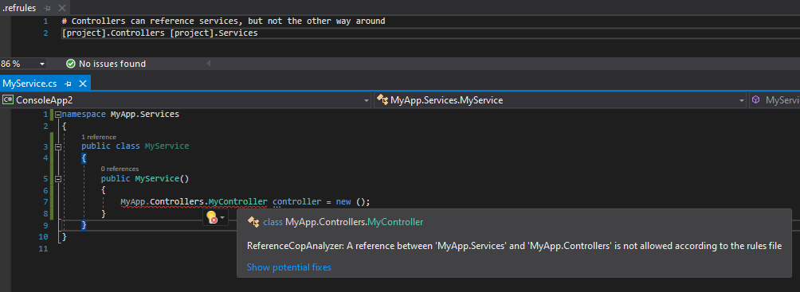
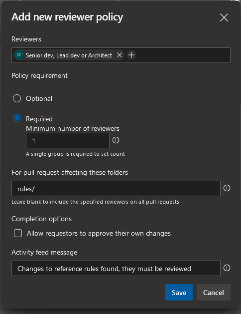

# ReferenceCopAnalyzer

 [](https://www.nuget.org/packages/ReferenceCopAnalyzer/)  [](https://twitter.com/knifecore)

Analyzer that checks references from code to different namespaces in .NET, based on your own rules

# About

If you are working on a code base with multiple developers and you have some ideas about how dependencies must flow, it is a good idea to translate those ideas to a set of rules. But checking those rules manually when changes are made can be cumbersome and error-prone.

ReferenceCopAnalyzer allows you to define those rules in a separate file and will report anything in your code that violates the rules. It uses [a code analyzer](https://docs.microsoft.com/en-us/dotnet/framework/code-analyzers), which runs as part of the compilation process. That makes it easy to install, fast and well-integrated into your development tooling (IDE). Also, it requires no extra effort to setup in your CI build.

Here's an example of a rule that is defined and a violation being reported in Visual Studio:


This project is heavily inspired by [NsDepCop](https://github.com/realvizu/NsDepCop), but a bit easier to use and it supports .NET Core (and .NET 5+).

# Installation

1. Install the NuGet package in your project. Run the following command in the NuGet package manager console
```
Install-Package ReferenceCopAnalyzer
```
or using the .NET cli
```
dotnet add package ReferenceCopAnalyzer
```
2. Add a file called `.refrules` anywhere in your project and ensure that it is registered as an `AdditionalFile` in your project file.
```xml
<ItemGroup>
  <AdditionalFiles Include=".refrules" />
</ItemGroup>
```
Alternatively, set `C# analyzer additional file` as the build action on the file properties in Visual Studio.

You may notice errors already popping up. This is because there are no rules defined yet. Please proceed to the next section.

# Configuration

The contents of the `.refrules` file will be used by the analyzer to determine how dependencies are allowed to flow. The following are some examples to help you get started defining those rules.

The file format is inspired by `.gitignore` files. However, any dependencies that do not match any of the rules, will get reported.

## Allow everything

Here is an example `.refrules` file that will allow any reference. This is not very useful, obviously, but it's a good way to get started.
```
# Allow any reference to and from anywhere
* *
```

## Allow references to System from anywhere

```
# Allow any class in any namespace to reference System
* System
```

If you also want to allow references to namespaces like `System.Text.Json` or `System.Threading`, you can add a wildcard.

```
# Allow any class in any namespace to reference System or any deeper namespace
* System
* System.*
```

## Allow references from your controllers to your services

Given a setup where you have a namespace `MyProject.Controllers` and a namespace `MyProject.Services`, you may want to ensure that controllers can reference services (and not the other way around).

```
# Controllers can access services, but not the other way around
MyProject.Controllers MyProject.Services
```

You can also generalize this rule, so that it can be used in multiple projects. This can be done using "named wildcards".

```
# Controllers can access services, but not the other way around
[project].Controllers [project].Services
```
In this example, `[project]` can be anything, but it has to be the same for the source (`[project].Controllers`) and the target (`[project].Services`) of the rule. So a reference from `One.Controllers` to `One.Services` will be allowed, but a reference from `One.Controllers` to `Two.Services` will not be.

## Example configuration for a MVC project

The example below shows an example that could be a starting point for a MVC project.

```
# Anything can reference System, e.g. for using Console.WriteLine(...)
* System

# Services can reference things under the Data namespace, e.g. for DB or DTO classes.
# And anything under System.* for doing things like web requests and serialization.
[project].Services [project].Data
[project].Services System.*

# Controllers blend things together, so they can access services, models and data.
[project].Controllers [project].Data
[project].Controllers [project].Models
[project].Controllers [project].Services
```

## Example configuration for a Sitecore Helix project

If you are familiar with [Sitecore Helix](https://helix.sitecore.com/principles/architecture-principles/layers.html) architecture, this may be a good starting point for setting up rules for that. Note that this can be used regardless of whether you are using a 'module is a .csproj' approach or not.

```
# Dependencies flow from project to feature to foundation
[ca].Project.* [ca].Feature.*
[ca].Feature.* [ca].Foundation.*

# Foundation projects are allowed to reference each other
[ca].Foundation.* [ca].Foundation.*

# Controllers are allowed to reference models
[ca].Feature.[f].Controllers [ca].Feature.[f].Models
[ca].Foundation.[f].Controllers [ca].Foundation.[f].Models

# Any module is allowed to reference their own root namespace
[ca].Feature.[f].* [ca].Feature.[f]
[ca].Foundation.[f].* [ca].Foundation.[f]
[ca].Project.[f].* [ca].Project.[f]
```

# Miscellaneous

## Using statements that are not needed

You may run into "false positives" for using statements that are not actually used. ReferenceCopAnalyzer will still report them, if they violate the rules.

But since they aren't needed anyway, why not just remove them? And [IDE0005](https://docs.microsoft.com/en-us/dotnet/fundamentals/code-analysis/style-rules/ide0005) reports them (this analyzer comes with .NET 5+ by default, or can be [installed separately if needed](https://docs.microsoft.com/en-us/dotnet/fundamentals/code-analysis/overview)).

If you really want to keep things clean, just set IDE0005 severity to 'error'. You just need to add a `.editorconfig` file and include the following:
```
# IDE0005: Using directive is unnecessary.
dotnet_diagnostic.IDE0005.severity = error
```

## Use the same rules for all projects

`TODO`

## Add exra reviewers in pull requests if rules are updated

### In Azure DevOps

1. Place the `.refrules` file in a separate folder
2. Go to your repository and setup a branch policy
3. Under `Automatically included reviewers` add a new reviewer policy
4. Configure the policy to add a specific reviewer if the folder has changes

Example:

